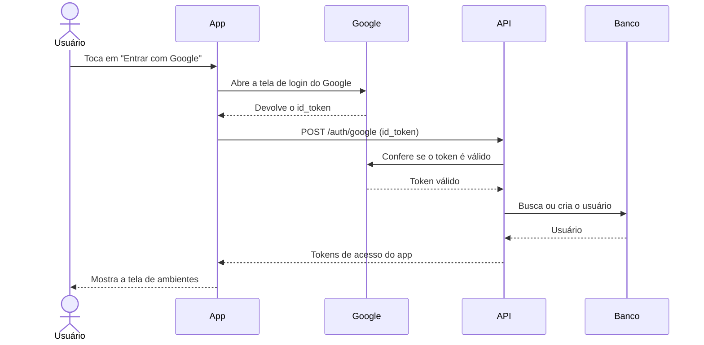
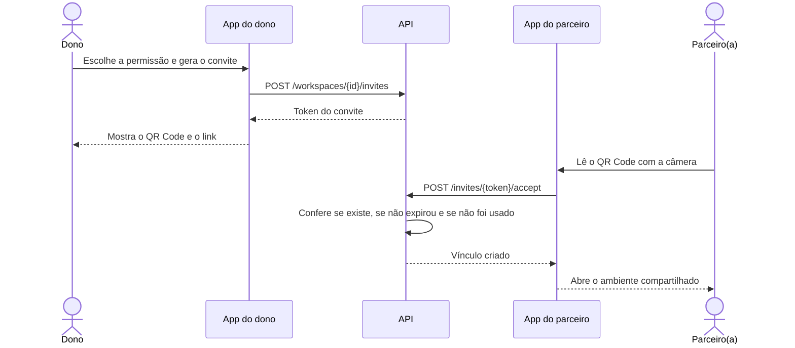
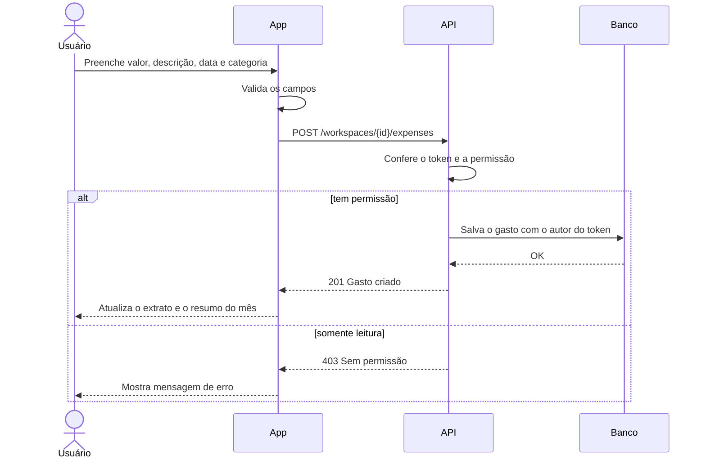

# Diagramas de Sequência

## 1. Login com Google

```mermaid
sequenceDiagram
    actor U as Usuário
    participant A as App
    participant G as Google
    participant S as API
    participant B as Banco

    U->>A: Toca em "Entrar com Google"
    A->>G: Abre a tela de login do Google
    G-->>A: Devolve o id_token
    A->>S: POST /auth/google (id_token)
    S->>G: Confere se o token é válido
    G-->>S: Token válido
    S->>B: Busca ou cria o usuário
    B-->>S: Usuário
    S-->>A: Tokens de acesso do app
    A-->>U: Mostra a tela de ambientes
```

Se qualquer passo falhar o acesso é negado. Não existe modo convidado.

## 2. Convite por QR Code

```mermaid
sequenceDiagram
    actor D as Dono
    participant A1 as App do dono
    participant S as API
    participant A2 as App do parceiro
    actor P as Parceiro(a)

    D->>A1: Escolhe a permissão e gera o convite
    A1->>S: POST /workspaces/{id}/invites
    S-->>A1: Token do convite
    A1-->>D: Mostra o QR Code e o link
    P->>A2: Lê o QR Code com a câmera
    A2->>S: POST /invites/{token}/accept
    S->>S: Confere se existe, se não expirou e se não foi usado
    S-->>A2: Vínculo criado
    A2-->>P: Abre o ambiente compartilhado
```

## 3. Registro de gasto

```mermaid
sequenceDiagram
    actor U as Usuário
    participant A as App
    participant S as API
    participant B as Banco

    U->>A: Preenche valor, descrição, data e categoria
    A->>A: Valida os campos
    A->>S: POST /workspaces/{id}/expenses
    S->>S: Confere o token e a permissão
    alt tem permissão
        S->>B: Salva o gasto com o autor do token
        B-->>S: OK
        S-->>A: 201 Gasto criado
        A-->>U: Atualiza o extrato e o resumo do mês
    else somente leitura
        S-->>A: 403 Sem permissão
        A-->>U: Mostra mensagem de erro
    end
```
